<<<<<<< HEAD
<<<<<<< HEAD
##### These procedure steps will be followed on the simulator

1. Click on the simulation of determination of in-situ density by core cutter method experiment. The following window will be displayed. Hover on "Description" to know the basic definition of the experiment. Click on the next button on the bottom right corner to proceed further.  
 

2. Click on the Scale to measure the height of the calibrating container.  
 

3. To measure the diameter of the calibrating container , click on the Vernier calliper then the diameter will be displayed.  
 

4. Enter the calculated value of volume of calibrating container and click on "Check" and "Result" to check the correct answer.   
 

5. Click on the sand to fill the sand pouring cylinder. 
 

6. Click on the cylinder to  measure the weight of the sand pouring cylinder with sand in it and note down the weight. 
 

7. Now weigh the empty weight of the cylinder. Click on the cylinder to place it on the weighing machine and note down the weight. 
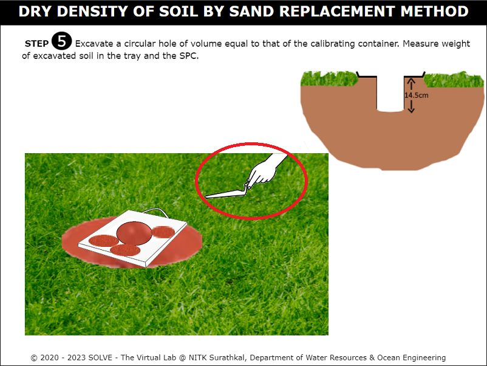 

8. Fill the sand to calibrate the container. Click on the knob to open and allow the sand to fill the container, then close the knob after the container is filled. Then click on the container filled with sand to measure the weight. Then click on the next button to proceed further.  
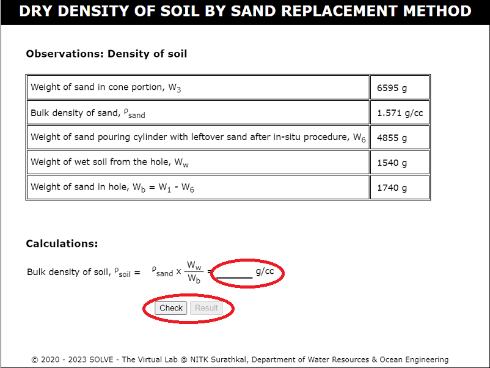 

9. Place the sand pouring cylinder on a glass plate. Now, click on the knob to open the shutter for sand to fill in the conical portion and then close it. Click on the sand retained on the glass plate to measure the weight of the sand filled in conical shape. 
 

10. Note down the weight of sand in the conical portion and calculate the weight of the sand portion without the cone portion. 
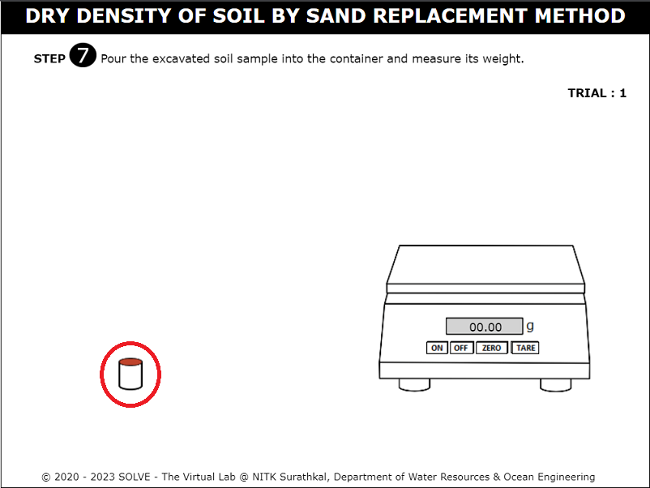 

11. Click on the trowel to excavate the circular hole on the ground which is of equal volume to that of the calibrating container.  
 

12. Click on the knob of the sand pouring cylinder and allow the sand to fill the excavated hole in ground.   
 

13. Click on the sand pouring cylinder to measure the weight of sand remaining on the cylinder after pouring it into the excavated hole. 
 

14.  Click on the sand pouring cylinder to measure the weight of sand remaining on the cylinder after pouring it into the excavated hole. 
 

15. Click on the tray to measure the weight of soil excavated from ground and note down the reading.  Enter the calculated value of bulk density of soil. Then click on "Check" and "Result" to check the result. 
 

16. Click on the empty cylinder to measure the weight and note down the reading. 
 

17. Click on the trowel to fill the soil into a cylinder. 
 

18. Click on the cylinder filled with soil to place it on the weighing machine and note down the weight. 
 

19. Click on the container removed from the oven to place it on the weighing machine and note down the reading. 
  
 

20. Calculate the dry density of soil and enter the value. Click on "Check" and "Result" to check the correct answer. Then inference will be displayed.  
   
=======
=======
>>>>>>> cf583c7ef42d0fa41b293d17023371b684a03cf6
#### These procedure steps will be followed on the simulator

1. When you click on the standard proctor compaction file, a new window will open as shown below; click on the description text box to view the definitions. Click on the Next button at the bottom right corner to move to the next step. 
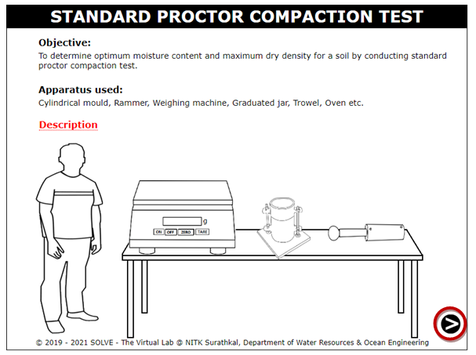 

2. Place the pan over the weighing balance by clicking on the arrow mark and take 2kg of air-dried soil sample and click on the next button to move to the next step. 
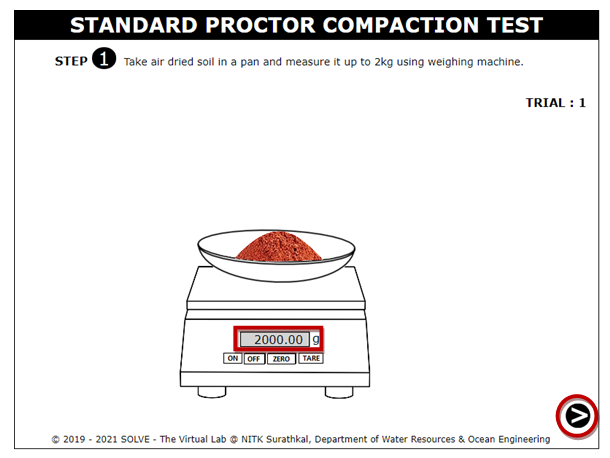 

3. Click on the arrow to Place a 20µm sieve on the pan and pour weighed quantity of air-dried soil (Fine aggregate) into the sieve, then close the lid. 
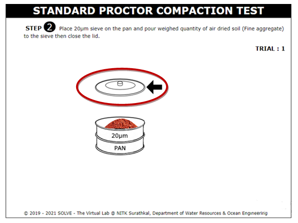 

4. Answer the question which is appearing on the screen to move to the next step. 
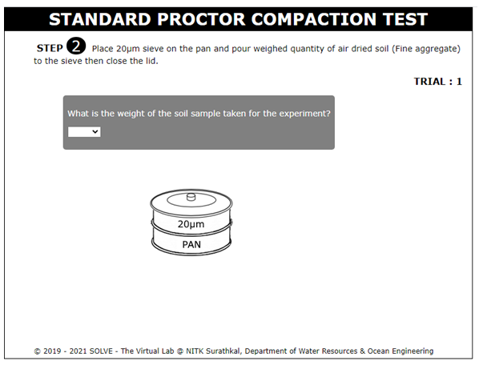 

5. Click on the Next button at the bottom right corner to move to the next step. 
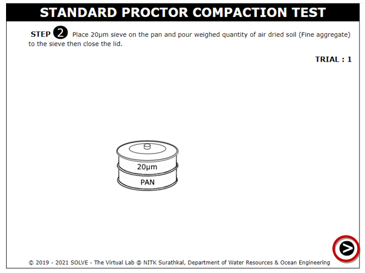 

6. Click on the arrow to Place the set of sieves in the mechanical shaker and allow shaking for 10 minutes and click on the next button to move to the next step. 
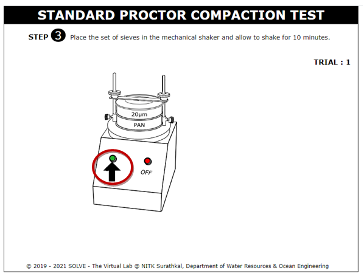 
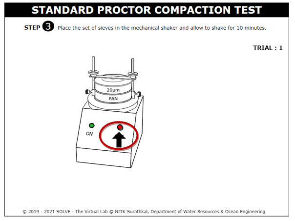 
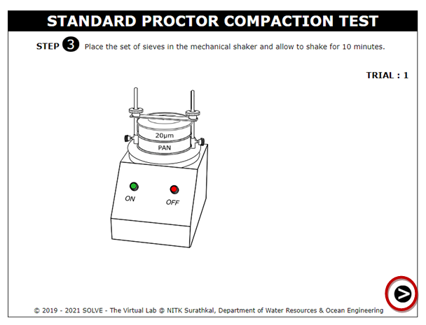 

7. By clicking on the arrow, collect the residue left on the 20µm sieve in a separate container and click on the next button to move to the next step. 
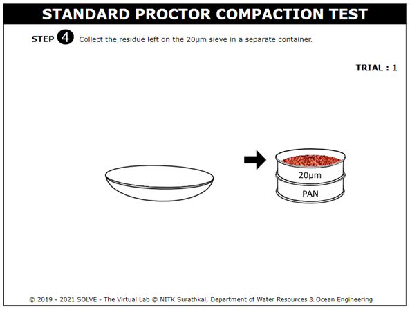 
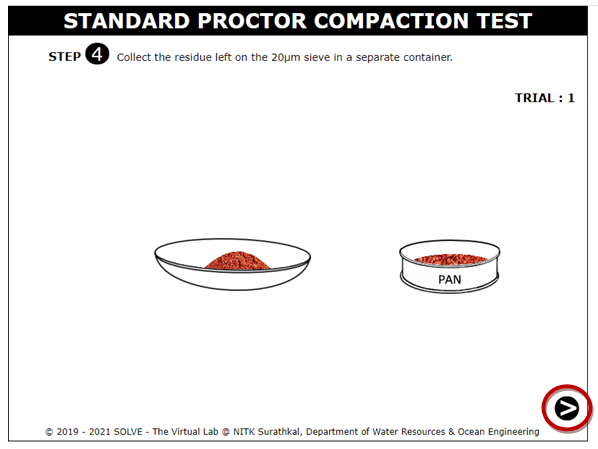 

8. Click on the measuring jar to measure the required quantity of water, then add it to the soil and mix it thoroughly and uniformly by clicking on the arrow mark and move to the next step. 
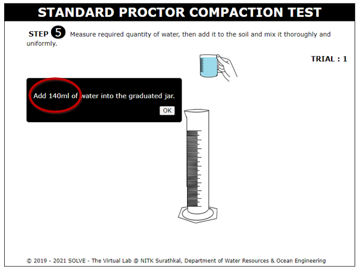 
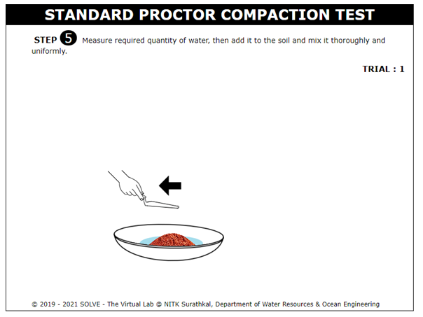 
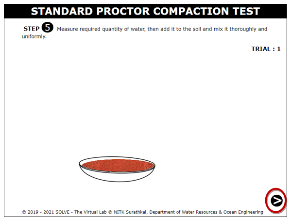 

9. Click on the mould and Measure the weight of the empty mould along with the base plate and click on the Next button. 
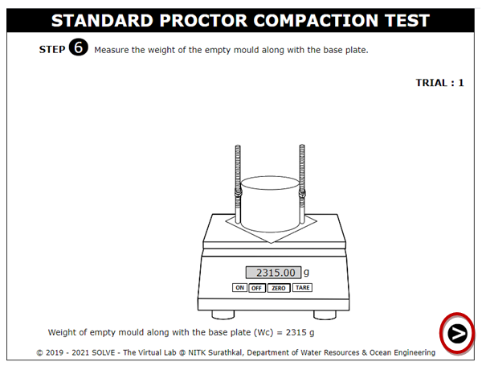 

10. By clicking over the arrow mark, fill the mould in 3 layers with the soil sample. Each layer is compacted by giving 25 evenly distributed blows using the rammer and press the next button. 
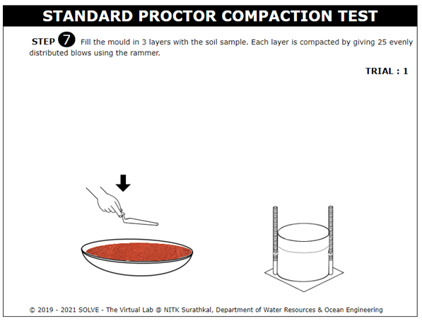 
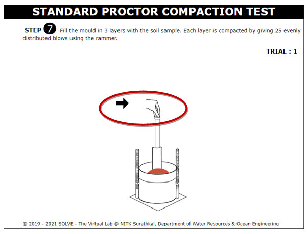 

11. Click on the arrow to remove the collar and then remove extra soil from the mould using edge steel and click on the Next button. 
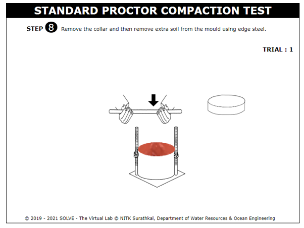 

12. Click on the arrow to weigh the mould containing the soil sample along with the base plate. 
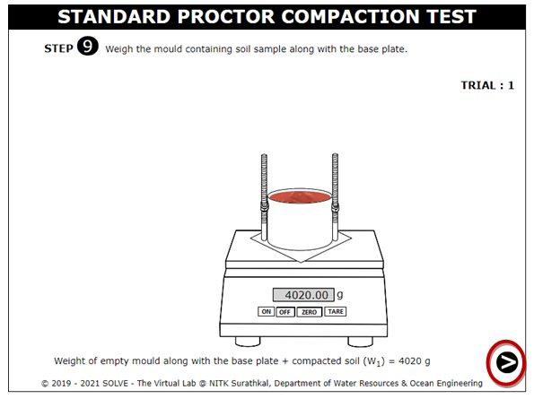 

13. Place the empty container by Clicking on the arrow to Measure its weight. 
 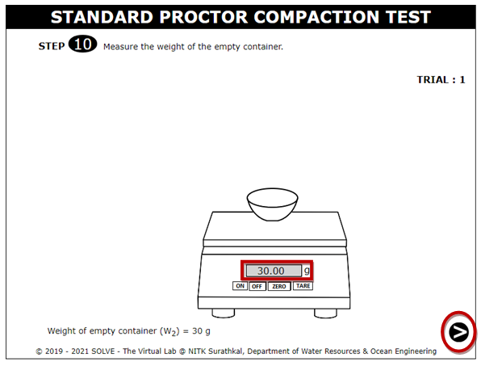 

14. Take some soil sample in a container for water content determination by clicking on the arrow mark. 
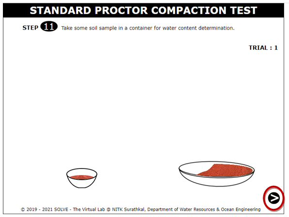 

15. Measure the weight of the container with wet soil and click on the Next button. 
 

16. Click on the door of the oven to open and click on the container with wet soil to place inside the oven and set the temperature of the oven to 110&deg;C for 24 hours. 
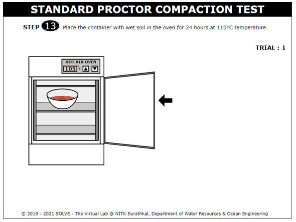 
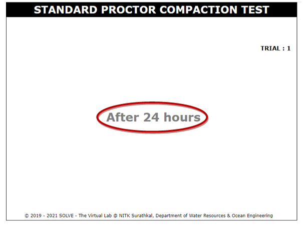 
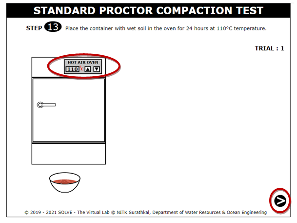 

17. Click on the container to place it over the weighing balance to measure the weight of the dry soil sample, and click on the Next button. 
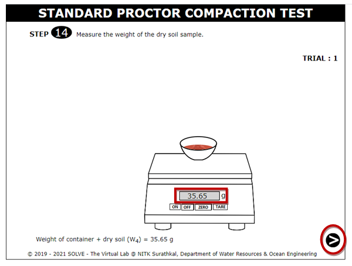 

18. Observations and calculations. 
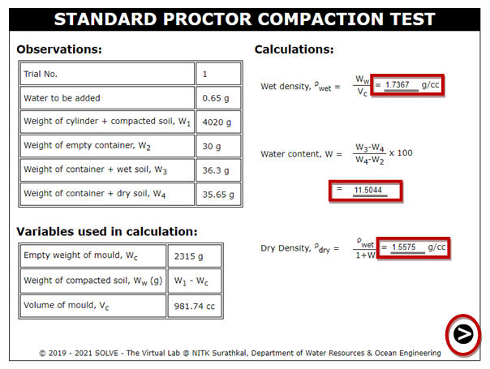 
<<<<<<< HEAD
>>>>>>> cf583c7ef42d0fa41b293d17023371b684a03cf6
=======
>>>>>>> cf583c7ef42d0fa41b293d17023371b684a03cf6
