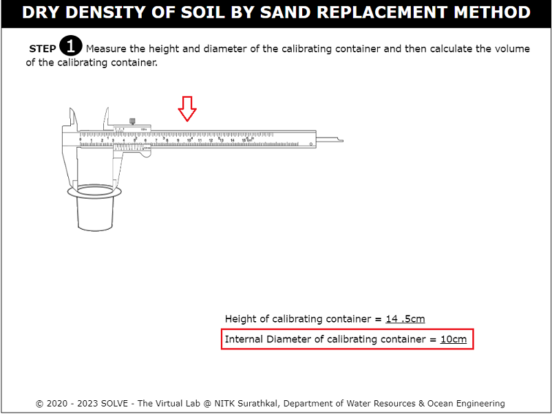
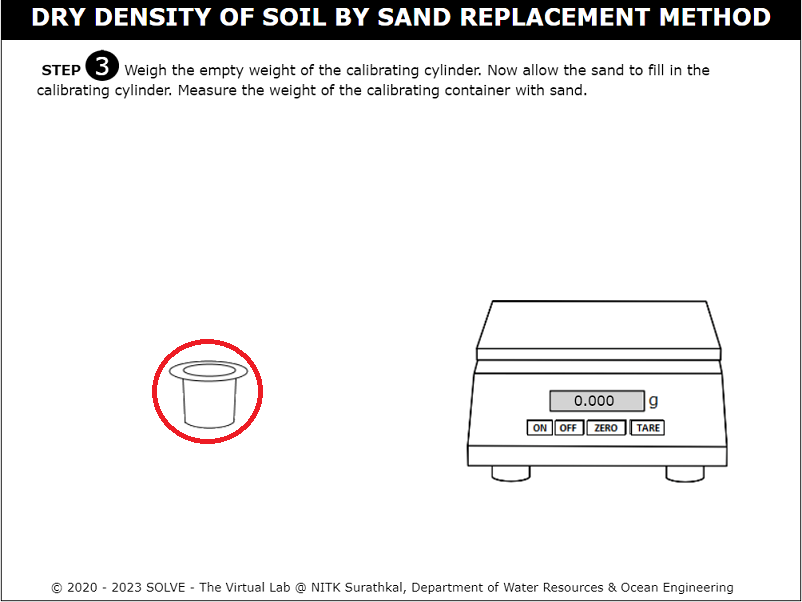
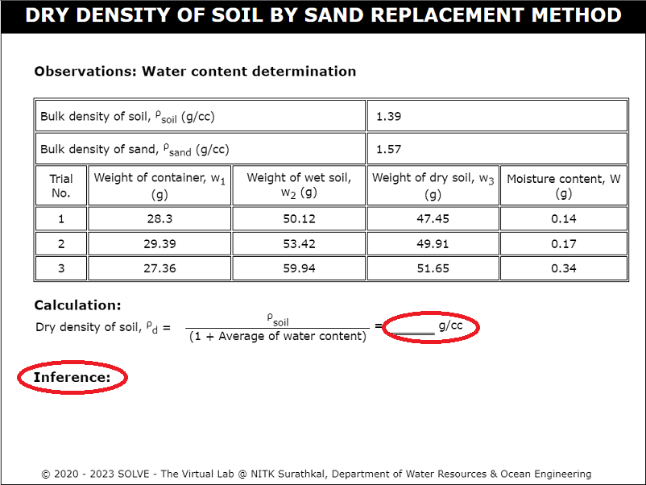

##### These procedure steps will be followed on the simulator

1. Click on the simulation of determination of in-situ density by core cutter method experiment. The following window will be displayed. Hover on "Description" to know the basic definition of the experiment. Click on the next button on the bottom right corner to proceed further.  
 

2. Click on the Scale to measure the height of the calibrating container.  
 

3. To measure the diameter of the calibrating container, click on the Vernier calliper then the diameter will be displayed.  
 

4. Enter the calculated value of volume of calibrating container and click on "Check" and "Result" to check the correct answer.   
 

5. Click on the sand to fill the sand pouring cylinder. 
 

6. Click on the cylinder to  measure the weight of the sand pouring cylinder with sand in it and note down the weight. 
 

7. Now weigh the empty weight of the cylinder. Click on the cylinder to place it on the weighing machine and note down the weight. 
 

8. Place the sand pouring cylinder on a glass plate. Now, click on the knob to open the shutter for sand to fill in the conical portion and then close it. Click on the sand retained on the glass plate to measure the weight of the sand filled in conical shape. Note down the weight of sand in the conical portion and calculate the weight of the sand portion without the cone portion. 
 

9. Click on the trowel to excavate the circular hole on the ground which is of equal volume to that of the calibrating container.  
 

10. Click on the knob of the sand pouring cylinder and allow the sand to fill the excavated hole in ground.   
 

11. Click on the sand pouring cylinder to measure the weight of sand remaining on the cylinder after pouring it into the excavated hole. 
 

12.  Click on the sand pouring cylinder to measure the weight of sand remaining on the cylinder after pouring it into the excavated hole. 
 

13. Click on the tray to measure the weight of soil excavated from ground and note down the reading.  Enter the calculated value of bulk density of soil. Then click on "Check" and "Result" to check the result. 
 

14. Click on the empty cylinder to measure the weight and note down the reading. 
 

15. Click on the trowel to fill the soil into a cylinder. 
 

16. Click on the cylinder filled with soil to place it on the weighing machine and note down the weight. 
 

17. Click on the container removed from the oven to place it on the weighing machine and note down the reading. 
  
 

18. Calculate the dry density of soil and enter the value. Click on "Check" and "Result" to check the correct answer. Then inference will be displayed.  
   
