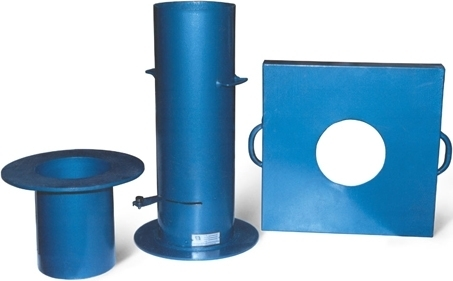
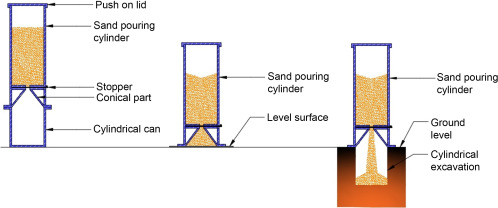

### INTRODUCTION

Dry density of soil refers to the ratio of total mass of soil to that of its volume in its dry state. The in-situ density refers to the mass per unit volume of Soil in the undisturbed state or compacted soil in-place. The moisture content is likely to vary from time and hence the field density also. So it is required to report the test result in terms of dry density.

Field density is used in finding the stress in the Soil due to its overburden pressure.

Field density values have a very vast range of applications and play an important role in determining various parameters as mentioned below:

<ol><li>Estimating the bearing capacity of soil foundation systems, settlement of footings, earth pressures behind the retaining walls and embankments.</li>
<li>The stability of natural slopes, dams, embankments and cuts is checked with the help of the density of those soils.</li>
<li>It is the density that controls the field compaction of soils.</li>
<li>The permeability of soils depends upon their density.</li>
<li>The relative density of cohesionless soils is found by knowing the dry density of Soil in natural, loosest and densest states.</li>
<li>Void ratio, porosity and degree of saturation also can be calculated using the density of Soil.</li>
</ol>

### Sand Replacement method

In the sand replacement method of determining field density, it consists of a cylindrical calibrating container, Sand Pouring Cylinder and a tray with hole as depicted in the image below.

  

Sand Replacement Apparatus

( Source: <a href="https://i0.wp.com/civilblog.org/wp-content/uploads/2014/04/Sand-Replace-Method.jpg?ssl=1">https://i0.wp.com/civilblog.org/wp-content/uploads/2014/04/Sand-Replace-Method.jpg?ssl=1</a>)

Sand will be filled in the Sand Pouring Cylinder and is calibrated using the cylindrical calibrating container. The exact volume of the extra conical portion of sand is found out in the second step. After this the apparatus is taken to the field and a hole is dug into the ground of the size of that of the calibrating container and again sand is allowed to fill in this hole. The amount of soil dug at site is collected and brought to the lab for further analysis.

  

Sand Replacement method procedure

( Source: <a href=" https://ars.els-cdn.com/content/image/3-s2.0-B9780128170489000093-f09-26-9780128170489.jpg"> https://ars.els-cdn.com/content/image/3-s2.0-B9780128170489000093-f09-26-9780128170489.jpg</a>)

#### Formula used for the calculation of dry density :

The formula used to calculate the field density of soil which was collected during the conduction of the experiment :

 

The formula used to calculate the field soil water content :

 

The formula to calculate the dry density of the soil sample collected from field :

 
